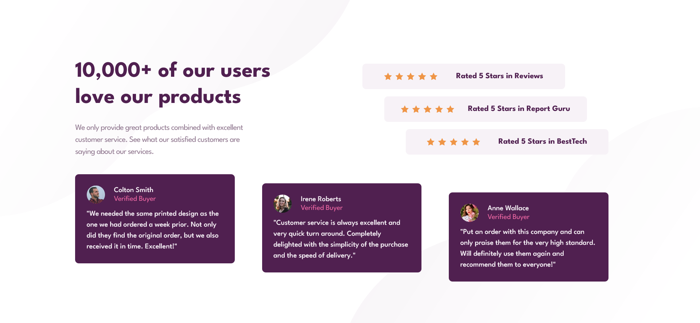

# FM - Social proof section solution

This is a solution to the [Social proof section challenge on Frontend Mentor](https://www.frontendmentor.io/challenges/social-proof-section-6e0qTv_bA).

## Table of contents
- [Brief](#brief)
- [Screenshot](#screenshot)
- [Links](#links)
- [Built with](#built-with)
- [Author](#author)

## Brief
Your challenge is to build out this social proof section and get it looking as close to the design as possible.
You can use any tools you like to help you complete the challenge. So if you've got something you'd like to practice, feel free to give it a go.

## Screenshot

## Links

[Social proof section page]([https://your-solution-url.com](https://axinitm.github.io/FM-Social-proof-section/))

## Built with

- Semantic HTML5 markup
- CSS custom properties
- Flexbox
- Mobile-first workflow

## Author

- Website - [Andrei Martinenko](https://www.frontender.biz)
- Github - [@AxinitM](https://www.frontendmentor.io/profile/AxinitM)
- Frontend Mentor - [@AxinitM](https://github.com/AxinitM)
